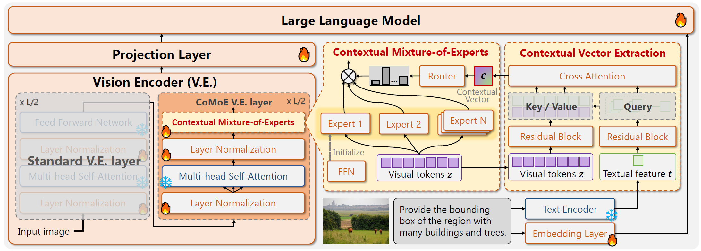

# [CVPR 2026] CoVFT: Context-aware Visual Fine-tuning for Multimodal Large Language Models


**Authors:** [Nan Zhou](mailto:zhounan0431@buaa.edu.cn), [Huiqun Wang](mailto:hqwangscse@buaa.edu.cn), [Yaoyan Zheng](mailto:yaoyanzheng@buaa.edu.cn), [Di Huang](mailto:dhuang@buaa.edu.cn) (Corresponding author)  
**Affiliation:** State Key Laboratory of Complex and Critical Software Environment & School of Computer Science and Engineering, Beihang University

[](https://arxiv.org/abs/2603.21077)
[](https://github.com/weeknan/CoVFT)

---

## Abstract

Multimodal large language models (MLLMs) achieve remarkable progress in cross-modal perception and reasoning, yet a fundamental question remains unresolved: **should the vision encoder be fine-tuned or frozen?** Despite the success of models such as LLaVA and Qwen-VL, inconsistent design choices and heterogeneous training setups hinder a unified understanding of visual fine-tuning (VFT) in MLLMs. Through a configuration-aligned benchmark, we find that existing VFT methods fail to consistently outperform the frozen baseline across multimodal tasks. Our analysis suggests that this instability arises from **visual preference conflicts**, where the context-agnostic nature of vision encoders induces divergent parameter updates under diverse multimodal context. To address this issue, we propose the **Context-aware Visual Fine-tuning (CoVFT)** framework, which explicitly incorporates multimodal context into visual adaptation. By integrating a **Context Vector Extraction (CVE)** and a **Contextual Mixture-of-Experts (CoMoE)** module, CoVFT decomposes conflicting optimization signals and enables stable, context-sensitive visual updates. Extensive experiments on 12 multimodal benchmarks demonstrate that CoVFT achieves state-of-the-art performance with superior stability. Notably, fine-tuning a 7B MLLM with CoVFT surpasses the average performance of its 13B counterpart, revealing substantial untapped potential in visual encoder optimization within MLLMs.

---

## Framework



*Contextual Vector Extraction (CVE) generates a contextual vector by aggregating multimodal cues through text-guided cross-attention. Contextual Mixture-of-Experts (CoMoE) injects the contextual vector into the vision encoder via context-conditioned expert routing, enabling adaptive visual parameter updates.*


---

## Overview

We build upon the LLaVA two-stage training framework and focus on **Stage 2 (instruction tuning)**. We investigate various visual encoder fine-tuning strategies for better vision-language alignment.

**Supported VFM tuning types:**
- **CoVFT** (Ours): `context_moe_layernorm` — Context-aware MoE with LayerNorm
- **Full Fine-tuning**: `fullft`
- **LoRA**: `lora`
- **BitFit**: `bias`
- **VPT**: `vpt` (Visual Prompt Tuning)

---

## Environment Setup

### 1. Create Conda Environment

```bash
conda create -n llava_covft python=3.10 -y
conda activate llava_covft
```

### 2. Install Dependencies

```bash
pip install -r requirements.txt
```

### 3. Install Flash Attention (Recommended)

```bash
pip install flash-attn --no-build-isolation
```

> **Note:** If Flash Attention installation fails, the code falls back to xformers or vanilla attention.

---

## Data Preparation

### Stage 1: Pretraining Data

Please refer to [LLaVA](https://github.com/haotian-liu/LLaVA) for pretraining data preparation:

- **LAION-CC-SBU**: Image-caption pairs (~558K)
- Place data under `./data/` following LLaVA's structure
- Organize as: `./data/llava_pretrain/blip_laion_cc_sbu_558k_meta.json`, `./data/llava_pretrain/blip_laion_cc_sbu_558k.json` and `./data/llava_pretrain/images/`


### Stage 2: Instruction Tuning Data

Follow [LLaVA 1.5](https://github.com/haotian-liu/LLaVA) for instruction data:

- **LLaVA v1.5 Mix 665K**: `llava_v1_5_mix665k.json`
- Images: COCO, GQA, OCR-VQA, TextVQA, Visual Genome, etc.
- Organize as: `./data/llava_finetune/llava_v1_5_mix665k.json` and `./data/llava_finetune/` (coco/gqa/.../)

### Evaluation Benchmarks

For downstream evaluation, download datasets from their official sources and place them in the paths specified below. All paths are relative to the project root.

| Benchmark | Official Link | Data Placement |
|-----------|---------------|----------------|
| **GQA** | [GQA Dataset](https://cs.stanford.edu/people/dorarad/gqa/) | `./playground/data/eval/gqa/` — Put images in `data/images/`, create `llava_gqa_testdev_balanced.jsonl`. The eval script also needs GQA official `eval.py` and question files in `data/`. |
| **ScienceQA** | [ScienceQA](https://scienceqa.github.io/) | `./playground/data/eval/scienceqa/` — Put `llava_test_CQM-A.json`, `problems.json`, `pid_splits.json` in root; images in `images/test/`. |
| **MMBench** | [OpenCompass / MMBench](https://github.com/open-compass/MMBench) | `./playground/data/eval/mmbench/` — Put `mmbench_dev_20230712.tsv` and/or `mmbench_dev_en_20231003.tsv` (images are base64-embedded in TSV). |
| **MMBench-CN** | Same as MMBench | `./playground/data/eval/mmbench_cn/` — Put `mmbench_dev_cn_20231003.tsv`. |
| **TextVQA** | [TextVQA](https://textvqa.org/) | `./playground/data/eval/textvqa/` — Put `llava_textvqa_val_v051_ocr.jsonl`, `TextVQA_0.5.1_val.json`, and images in `train_images/`. |
| **MME** | [MME Benchmark](https://github.com/BradyFU/Awesome-Multimodal-Large-Language-Models) | `./playground/data/eval/MME/` — Put `llava_mme.jsonl`, unzip `MME_Benchmark_release_version` for images, plus `convert_answer_to_mme.py` and `eval_tool/` from the MME repo. |
| **MMVP, AI2D, ADE, COCO, Omni, RealWorldQA** | [Cambrian](https://github.com/cambrian-mllm/cambrian) | `./playground/data/eval/<benchmark>/` — Follow [Cambrian](https://github.com/cambrian-mllm/cambrian) for data preparation. Each benchmark needs `{benchmark}_eval.py` and `{benchmark}_test.py` in its directory. |

**Directory structure overview:**
```
playground/data/eval/
├── gqa/
│   ├── llava_gqa_testdev_balanced.jsonl
│   └── data/
│       ├── images/           # GQA test images
│       ├── eval.py           # From GQA official eval
│       └── ...
├── scienceqa/
│   ├── llava_test_CQM-A.json
│   ├── problems.json
│   ├── pid_splits.json
│   └── images/test/
├── mmbench/
│   └── mmbench_dev_20230712.tsv   # or mmbench_dev_en_20231003.tsv
├── mmbench_cn/
│   └── mmbench_dev_cn_20231003.tsv
├── textvqa/
│   ├── llava_textvqa_val_v051_ocr.jsonl
│   ├── TextVQA_0.5.1_val.json
│   └── train_images/
├── MME/
│   ├── llava_mme.jsonl
│   ├── MME_Benchmark_release_version/
│   ├── convert_answer_to_mme.py
│   └── eval_tool/
└── mmvp/, ai2d/, ade/, coco/, omni/, mmmu/, realworldqa/   # Cambrian format
```

> **Tip:** We find that for some benchmarks, fine-tuning the question format may improve context vector extraction accuracy (e.g., simplifying or removing complex multiple-choice options). Using a stronger text encoder may also achieve more robust question encoding. We encourage users to explore these options for better evaluation results (keep the original default question input to the LLM remains unchanged).

---

## Training

### Stage 1: Pre-training

For Stage 1 pre-training, two feasible approaches are provided below (choose either one according to your needs):

**Approach 1: Train the projector from scratch (based on LLaVA 1.5 codebase)**
Since the current codebase may be incompatible with Stage 1 pre-training, we recommend following the official [LLaVA 1.5](https://github.com/haotian-liu/LLaVA) setup directly:

1. Use the LLaVA pretraining script as the reference and train the multimodal projector in the same way as LLaVA-1.5. 

> **Reference script:** [LLaVA v1.5 Stage 1 Pretraining Script](https://github.com/haotian-liu/LLaVA/blob/main/scripts/v1_5/pretrain.sh)


```bash
# Reference: LLaVA scripts/v1_5/pretrain.sh
deepspeed llava/train/train_mem.py \
    --deepspeed ./scripts/zero2.json \
    --model_name_or_path lmsys/vicuna-7b-v1.5 \
    --version plain \
    --data_path ./data/LLaVA-Pretrain/blip_laion_cc_sbu_558k.json \
    --image_folder ./data/LLaVA-Pretrain/images \
    --vision_tower openai/clip-vit-large-patch14-336 \
    --mm_projector_type mlp2x_gelu \
    --tune_mm_mlp_adapter True \
    --mm_vision_select_layer -2 \
    --output_dir ./checkpoints/llava-v1.5-7b-pretrain \
    ...
```

After pretraining, place the projector at:

```
./checkpoints/llava-v1.5-7b-pretrain/mm_projector.bin
```

**Approach 2: Use pre-trained projector weights (fast setup)**
To skip the pre-training process, you can directly download the pre-trained projector weights (7B model) and extract them to the `./checkpoints/` directory:

> **Download link:** [Pre-trained LLaVA-1.5 Multimodal Projector](https://drive.google.com/file/d/1dnkJrKqQYjURejeXuq4S9YrlWdelKeup/view?usp=sharing)
> 
> After downloading and unzipping, ensure the weight file is placed at:
> 
> `./checkpoints/llava-v1.5-7b-pretrain/mm_projector.bin`
> 

### Stage 2: Instruction-tuning

In Stage 2, both the LLM and the projector are always trained. For the vision encoder, we explore various fine-tuning strategies, ranging from full fine-tuning to parameter-efficient methods (e.g., LoRA, BitFit, VPT) as well as our proposed context-aware approach. This enables a systematic study of how different vision encoder updating schemes affect multimodal alignment and overall performance during instruction tuning.

#### CoVFT (Ours)

```bash
bash scripts/v1_5/covft_exp4_last12L_layernorm.sh
```

Key configuration options:
- `--vfm_tuning_type context_moe_layernorm`: Use context-aware MoE with LayerNorm (CoVFT method)
- `--moe_num_experts 4`: Number of experts in the MoE module (default: 4)
- `--moe_top_k 4`: Number of experts selected per forward pass (default: 4, equals number of experts for dense routing)
- `--moe_start_layer 11`: Insert the CoMoE module starting from layer 11 of the vision encoder

> **Tips:** Our experiments show that sparse activation requires the integration of a balancing loss to achieve performance comparable to dense activation on certain benchmarks. However, since the computational overhead of the vision backbone is far lower than that of the LLM, sparse activation does not bring significant efficiency gains. For this reason, **the current version does not support setting `--moe_top_k` to a value smaller than `moe_num_experts`**.

#### Baselines

| Method | Script |
|--------|--------|
| **Full Fine-tuning** | `scripts/v1_5/finetune_fullft_vfm.sh` |
| **LoRA** | `scripts/v1_5/finetune_lora_vfm.sh` |
| **BitFit** | `scripts/v1_5/finetune_biastune_vfm.sh` |
| **VPT** | `scripts/v1_5/finetune_vpt_vfm.sh` |

---

## Evaluation

Run evaluation on a checkpoint:

```bash
# Set checkpoint path
export CKPT_DIR=./checkpoints/LLaVA_covft_exp4_last12L_layernorm

# Run full evaluation (see run_eval.sh)
bash run_eval.sh
```

Or run individual benchmarks:

```bash
# ScienceQA
bash scripts/v1_5/eval/sqa.sh --ckpt $CKPT_DIR

# GQA
bash scripts/v1_5/eval/gqa.sh --ckpt $CKPT_DIR

# MMBench
bash scripts/v1_5/eval/mmbench.sh --ckpt $CKPT_DIR
bash scripts/v1_5/eval/mmbench_cn.sh --ckpt $CKPT_DIR

# MME
bash scripts/v1_5/eval/mme.sh --ckpt $CKPT_DIR

# TextVQA
bash scripts/v1_5/eval/textvqa.sh --ckpt $CKPT_DIR

# Cambrain Benchmarks (MMVP, RealWorldQA, COCO, ADE, Omni, MMMU, AI2D)
bash scripts/v1_5/eval/run_benckmark_cambrain.sh --ckpt $CKPT_DIR --benchmark mmvp
```

---

## Project Structure

```
.
├── llava/                    # Model & training code
│   ├── model/                # LLaVA architecture, VFM tuning modules
│   ├── train/                # Training scripts
│   ├── eval/                 # Evaluation utilities
│   └── serve/                # Inference / demo
├── assets/                   # Figures
│   └── pipeline.pdf          # CoVFT framework illustration
├── scripts/
│   ├── v1_5/                 # Stage 2 training & eval scripts
│   │   ├── covft_exp4_last12L_layernorm.sh   # CoVFT (ours)
│   │   ├── finetune_fullft_vfm.sh
│   │   ├── finetune_lora_vfm.sh
│   │   ├── finetune_biastune_vfm.sh
│   │   ├── finetune_vpt_vfm.sh
│   │   └── eval/
│    
├── playground/data/eval/     # Evaluation benchmarks
├── run_eval.sh
└── requirements.txt
```

---

## Citation

If you find this work useful, please cite:

```bibtex
@inproceedings{zhou2026covft,
  title={CoVFT: Context-aware Visual Fine-tuning for Multimodal Large Language Models},
  author={Zhou, Nan and Wang, Huiqun and Zheng, Yaoyan and Huang, Di},
  booktitle={Proceedings of the IEEE/CVF Conference on Computer Vision and Pattern Recognition (CVPR)},
  year={2026}
}
```

---

## Acknowledgments

- [LLaVA](https://github.com/haotian-liu/LLaVA) - LLaVA two-stage training framework
- [Vicuna](https://github.com/lm-sys/FastChat) - Base language model
- [Cambrian](https://github.com/cambrian-mllm/cambrian) - Vision-centric benchmark evaluation
